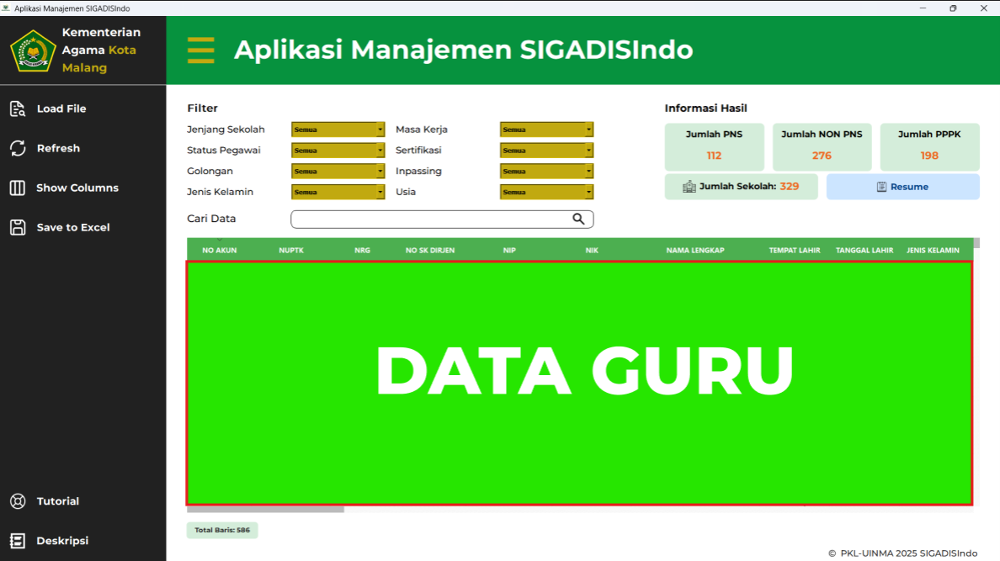

## SIGADISIndo

**SISTEM INFORMASI GURU AGAMA ISLAM INDONESIA**  
Aplikasi desktop untuk manajemen data guru Pendidikan Agama Islam (PAI) di Indonesia.

## 📝 Deskripsi

SIGADISIndo adalah sistem informasi yang dikembangkan untuk membantu dalam mengelola data guru PAI, termasuk fitur pencarian, filter, dan ekspor data. Aplikasi ini dibangun dengan Python dan PyQt5, serta memiliki antarmuka pengguna yang intuitif untuk memudahkan pengguna non-teknis.

## 🛠️ Teknologi yang Dibutuhkan

- Python 3.10
- PyQT5
- Qt Designer (Sebagai Desain UI)
- Pandas
- Openpyxl

## 🚀 Cara Menjalankan

1. **Clone Repository**

   ```bash
   git clone https://github.com/Nanimz/SIGADISIndo.git
   cd SIGADISIndo
   ```

2. **(Opsional) Buat dan Aktifkan Virtual Environment**

   ```bash
   # Windows
   python -m venv venv
   .\venv\Scripts\activate

   # Mac/Linux
   python3 -m venv venv
   source venv/bin/activate
   ```

3. **Install Dependensi**

   ```bash
   pip install PyQt5 pandas openpyxl python-docx
   ```

4. **Jalankan Aplikasi**

   ```bash
   python main.py
   ```

## 🖥️ Tampilan Aplikasi



## 📌 Catatan Tambahan

- Proyek ini dibuat sebagai bagian dari kegiatan **PKL (Praktek Kerja Lapangan) di Kantor Kementerian Agama Kota Malang**, dengan tujuan membantu digitalisasi dan pengelolaan data guru Pendidikan Agama Islam (PAI).
- Folder `venv/` **tidak disertakan** dalam repositori. Jika ingin menjalankan proyek ini, buat virtual environment secara lokal dan install semua dependensi yang dibutuhkan.
- File antarmuka pengguna dibuat dengan **Qt Designer**, dan dapat diedit melalui file `.ui` yang berada di dalam folder `UI/`.
- Jika Anda ingin mengubah proyek ini menjadi aplikasi desktop mandiri (.exe), Anda bisa menggunakan **[auto-py-to-exe](https://github.com/brentvollebregt/auto-py-to-exe)**. Berikut langkah-langkahnya:

  1. **Instal auto-py-to-exe**

     ```bash
     pip install auto-py-to-exe
     ```

  2. **Jalankan auto-py-to-exe**

     ```bash
     auto-py-to-exe
     ```

  3. **Konfigurasi di GUI auto-py-to-exe:**

     - Pilih file utama: `main.py`
     - Pilih opsi: **"One File"**
     - Tambahkan folder seperti `assets/` dan `icons/` pada bagian **"Additional Files"**
     - Sesuaikan opsi lainnya sesuai kebutuhan

  4. Klik **Convert .py to .exe**

  5. File `.exe` akan muncul di folder `output/` dan dapat dijalankan langsung di Windows tanpa perlu menginstal Python.

---
